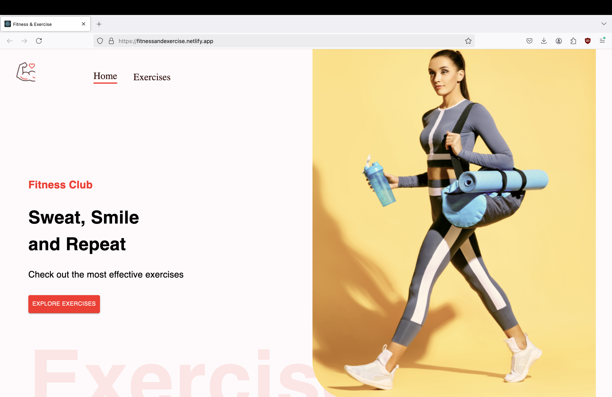
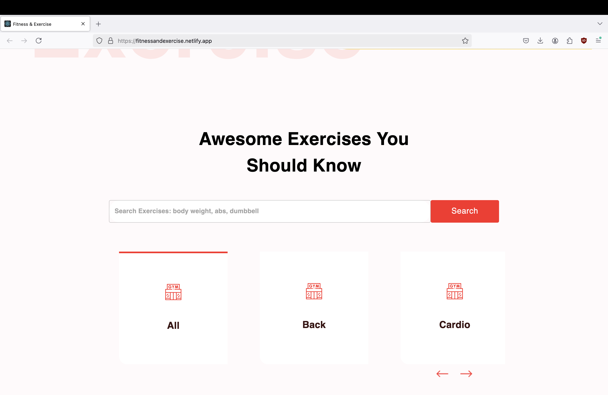
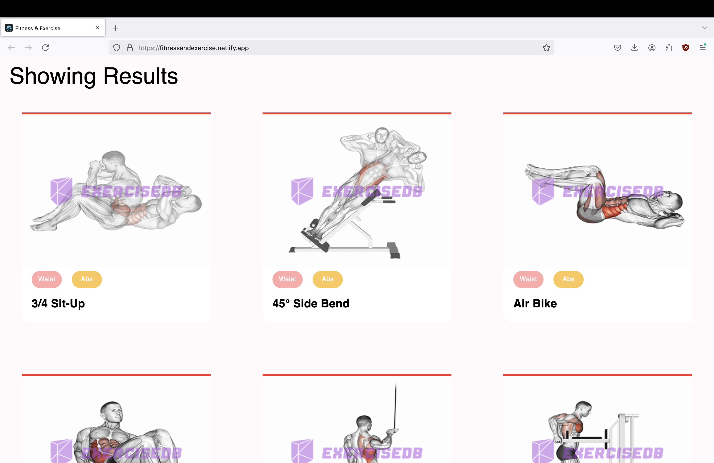
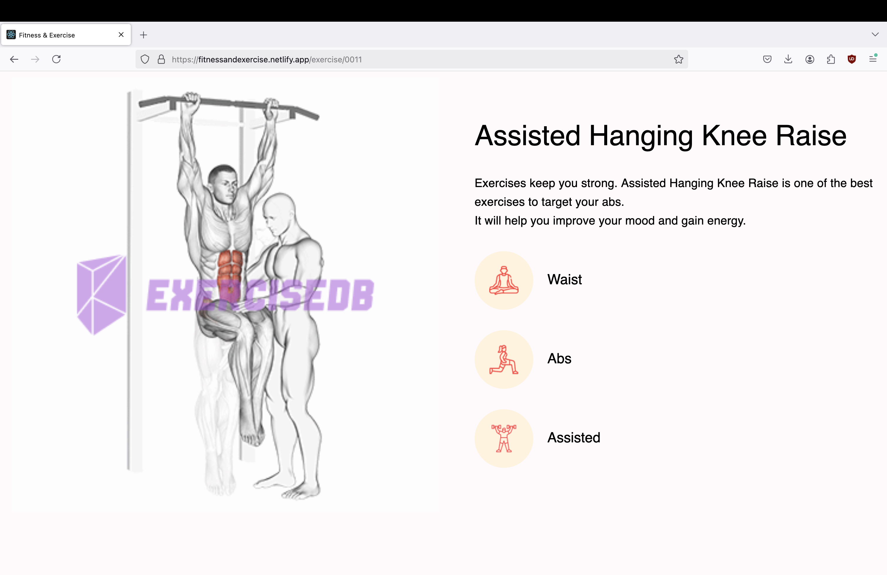
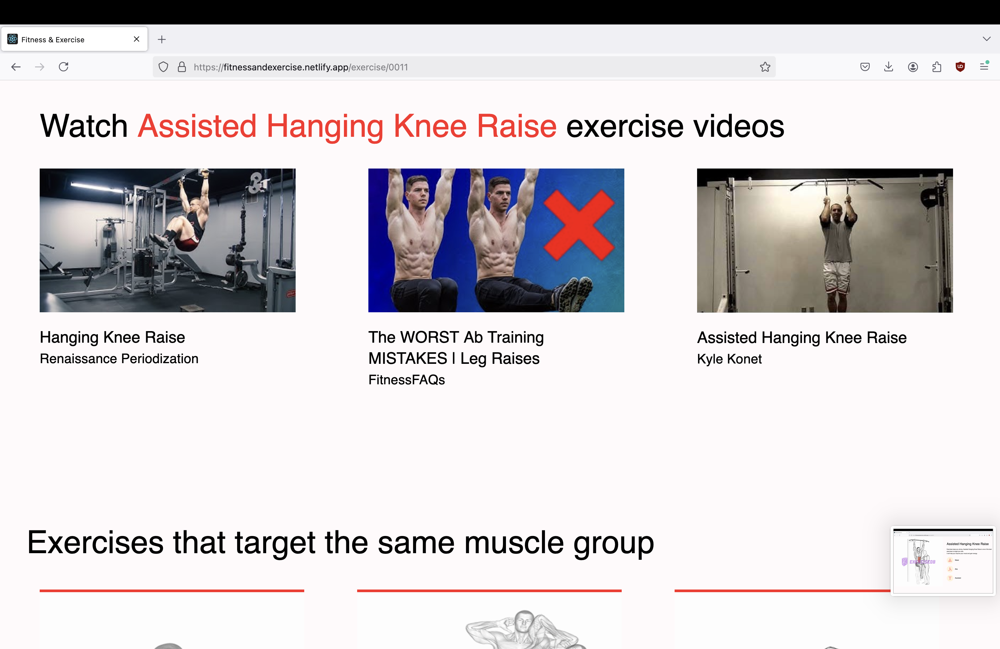
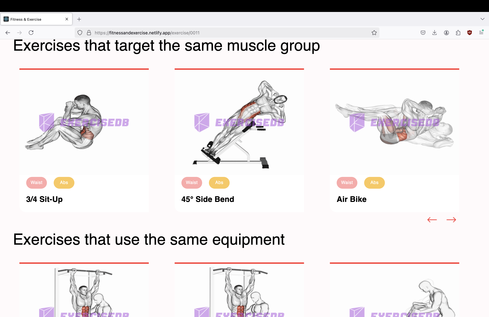
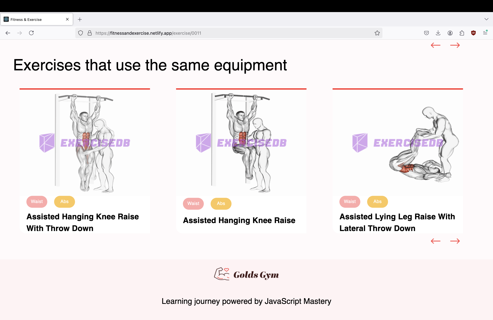

# fitness-website
This is a fitness exercise app built using React, RapidApi and MaterialUI. The app is deployed on Netlify and can be visited [here](https://fitnessandexercise.netlify.app/)!  

Users are able to search exercises and browse exercises according to different categories of body parts such as back, legs, arms. When users click on an exercise shown in the results section, it brings them to a page to learn more about the workout in detail. There, YouTube videos on that exercise and exercises similar to the target muscle as well as equipment used will be displayed.

The purpose of this app is to make it convenient for those who want to start their fitness journey. They can also explore many different exercises along the way.

### Tech Stack
**Frontend**:
- React
- Material UI (MUI)

**API**:
- Rapid API
  - ExerciseDB
  - YouTube Search

**Tools**:
- VS Code
- Netlify
- GitHub

## Acknowledgements
Credits: [JavaScript Mastery](https://www.youtube.com/watch?v=KBpoBc98BwM&list=PL6QREj8te1P6wX9m5KnicnDVEucbOPsqR&index=12) 

## Notes & Lessons Learned
- Create .env file to store API keys. Then create a .gitignore file and write ".env" file to ensure that keys or passwords are not committed to remote repository.
- HorizontalScrollbar.js required some changes to the styling from the one demonstrated in the video by JavaScript Mastery
  - Added a Box element around ScrollMenu to adjust styling
- Used ScrollLink to scroll down to "Showing Results" section when users click on Search button or "EXPLORE EXERCISES"

## Future Improvements
- Add user authentication Login, Signup and Password Reset
- Utilize database so that users can save their favorite exercises
  
## Interface Overview

- Overview of the website
- 
- 
- 
- 
- 
- 
- 
